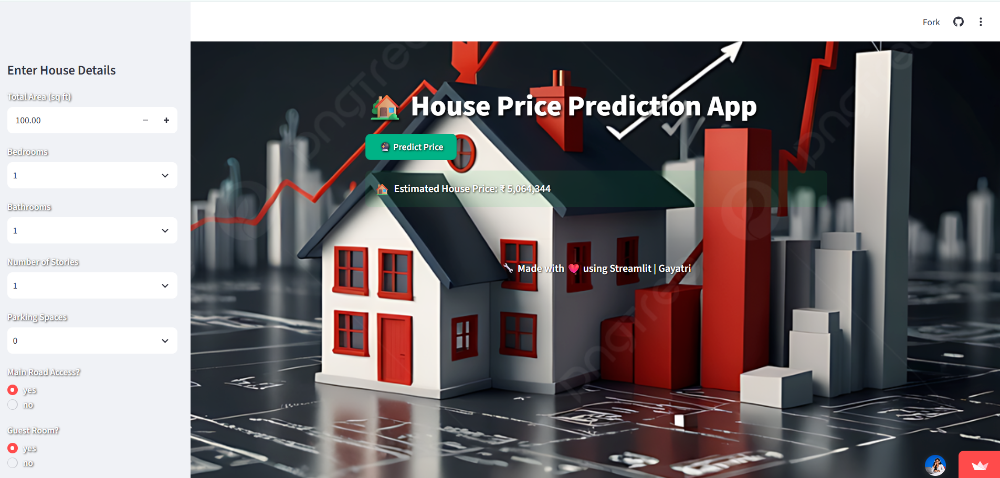
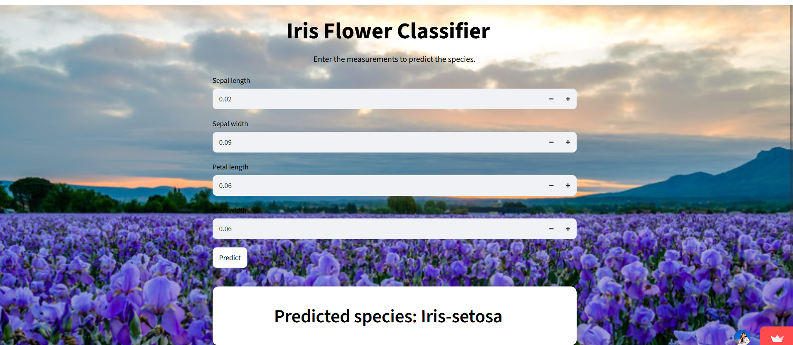
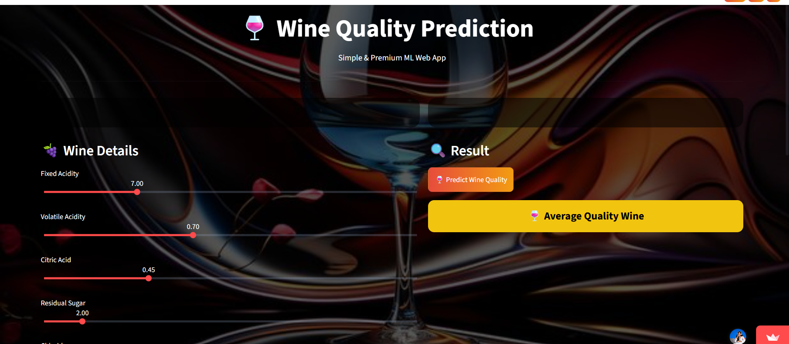

<div align="center">

<picture>
  <source media="(prefers-color-scheme: dark)" srcset="./assets/dark.svg">
  <source media="(prefers-color-scheme: light)" srcset="./assets/light.svg">
  
</picture>

<br>


</div>

---

# 👋 Hi, I'm Gayatri Chebolu

<table>
<tr>
<td width="65%">

### About Me

- Recent B.Tech Graduate in Computer Science & Engineering (Artificial Intelligence).
- Passionate about Artificial Intelligence, Machine Learning and Generative AI.
- Building intelligent AI systems powered by LLMs and Agentic AI.
- Exploring Multi-Agent Systems, RAG Architectures and AI Deployment.
- Love solving real-world problems using AI and Machine Learning.

### Open To Opportunities

- AI Engineer
- Machine Learning Engineer
- Generative AI Engineer
- Software Engineer
- AI Research Intern

</td>

<td width="35%">


</td>
</tr>
</table>

---

# Tech Stack

### Programming Languages

<p>

</p>

### Frontend

<p>

</p>

### Backend

<p>

</p>

### Machine Learning & AI

- Scikit Learn
- TensorFlow
- PyTorch
- Hugging Face
- Pandas
- NumPy

### Generative AI

- LangChain
- LangGraph
- Transformers
- Sentence Transformers
- RAG
- Prompt Engineering
- Agentic AI

### Tools & Platforms

<p>

</p>

- Streamlit
- Render
- Vercel

---

# Internship Experience

### AI & Machine Learning Intern | 3Skill

**Duration:** Dec 2025 – Feb 2026

- Built Machine Learning classification models.
- Performed feature engineering and data preprocessing.
- Deployed applications using Streamlit.
- Worked with Scikit Learn and Python.

---

### AI Intern | Infosys Springboard

**Duration:** Sept 2025 – Nov 2025

- Built AI applications.
- Worked on Prompt Engineering.
- Developed OCR pipelines.
- Intelligent document processing using AI.

---

# Featured Projects

---

## AI Health Symptom Checker

<p align="center">

</p>

### Features

- AI Powered Health Assistant
- Disease Prediction System
- User Friendly Interface
- Intelligent Symptom Analysis
- AI Based Recommendations

### Technologies Used

```
Python
Flask
AI Models
HTML
CSS
JavaScript
Render
```

---

## House Price Prediction

<p align="center">

</p>

### Features

- House Price Prediction
- Data Preprocessing
- Machine Learning Regression
- Model Evaluation

### Technologies Used

```
Python
Pandas
NumPy
Scikit Learn
```

---

## Iris Flower Classification

<p align="center">

</p>

### Features

- ML Classification Model
- Data Visualization
- Exploratory Data Analysis
- Prediction System

### Technologies Used

```
Python
Scikit Learn
Pandas
NumPy
```

---

## Wine Quality Prediction

<p align="center">

</p>

### Features

- Wine Quality Classification
- Machine Learning Prediction
- Model Evaluation
- Data Analytics

### Technologies Used

```
Python
Scikit Learn
Machine Learning
```

---

# Certifications

- Foundations of Modern Machine Learning (IIIT Hyderabad)
- Applied Artificial Intelligence (Microsoft TechSaksham)
- IBM SkillsBuild AI Certificate
- Generative AI Certification
- Career Management Essentials
- AI Internship Certificates
- Machine Learning Internship Certificates

---

# Current Focus

### Learning

- Agentic AI
- Multi-Agent Systems
- Advanced Generative AI
- MLOps
- RAG Architectures

### Building

- AI Assistants
- LLM Applications
- Intelligent Automation Systems
- Generative AI Projects

### Exploring

- Cloud AI Services
- AI Deployment Pipelines
- Open Source Contributions

---

# GitHub Analytics

<div align="center">


</div>

---

# GitHub Streak

<div align="center">


</div>

---

# Contribution Graph

<div align="center">


</div>

---

# GitHub Trophies

<div align="center">


</div>

---

# Visitor Count

<div align="center">


</div>

---

# Connect With Me

<div align="center">

| Platform | Link |
|---------|---------|
| GitHub | https://github.com/CheboluGayatri |
| LinkedIn | https://www.linkedin.com/in/gayatri-chebolu/ |
| Portfolio | https://gayatri-portfolio-flax.vercel.app/ |
| Email | gayathrichebolu6@gmail.com |

</div>

---

# Let's Build AI Together

<div align="center">

### Building Intelligent AI Systems for the Future

AI • Machine Learning • Generative AI • Agentic AI • Open Source

⭐ Thank you for visiting my GitHub Profile.

</div>
