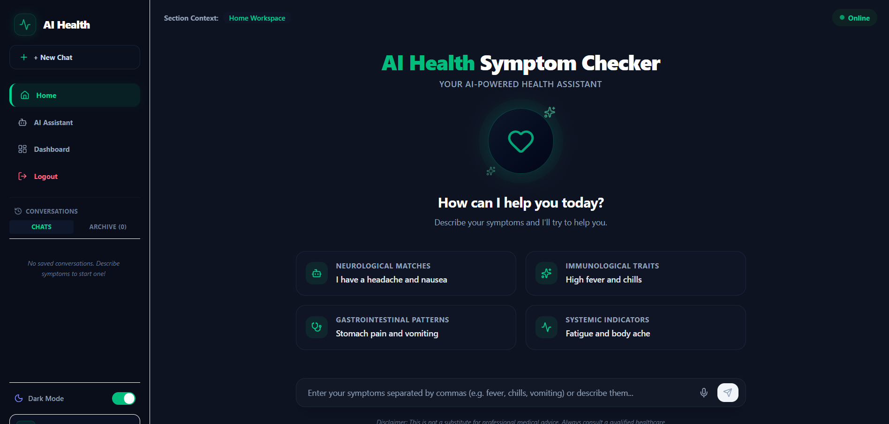

<div align="center">

<picture>
  <source media="(prefers-color-scheme: dark)" srcset="./assets/dark.svg">
  <source media="(prefers-color-scheme: light)" srcset="./assets/light.svg">
  
</picture>

<br>


</div>

---

## 👋 About Me

```python
class GayatriChebolu:

    name = "Gayatri Chebolu"

    role = [
        "AI Engineer",
        "Machine Learning Engineer",
        "Generative AI Developer"
    ]

    location = "Andhra Pradesh, India"

    education = "B.Tech in Computer Science & Engineering (AI)"

    interests = [
        "Artificial Intelligence",
        "Machine Learning",
        "Generative AI",
        "Large Language Models",
        "NLP",
        "Agentic AI",
        "Multi-Agent Systems"
    ]

    current_focus = [
        "Agentic AI",
        "RAG Architectures",
        "Advanced Generative AI",
        "MLOps",
        "AI Deployment"
    ]

    status = "Building Intelligent AI Systems 🚀"
```

---

## 🚀 Tech Stack

### Programming Languages

- Python
- SQL
- MySQL

### Frontend

- HTML
- CSS
- JavaScript

### Backend

- Flask
- FastAPI
- Streamlit

### Machine Learning & AI

- Scikit Learn
- TensorFlow
- PyTorch
- Pandas
- NumPy
- Hugging Face

### Generative AI

- LangChain
- LangGraph
- Transformers
- Sentence Transformers
- RAG
- Prompt Engineering
- Agentic AI

### Tools & Platforms

- Git
- GitHub
- VS Code
- Render
- Vercel

---

## 💼 Internship Experience

### AI & Machine Learning Intern | 3Skill

- Built ML classification models.
- Data preprocessing and feature engineering.
- Model evaluation and Streamlit deployment.

### AI Intern | Infosys Springboard

- Built AI applications.
- Worked on Prompt Engineering.
- Developed OCR pipelines.
- Intelligent document processing solutions.

---

## 🌟 Featured Projects

### AI Health Symptom Checker



- AI-powered health assistant.
- Symptom analysis and recommendations.
- User-friendly web interface.

---

### House Price Prediction


- Machine Learning regression model.
- House price prediction system.

---

### Iris Flower Classification


- ML classification model.
- Exploratory Data Analysis and prediction.

---

### Wine Quality Prediction


- Quality prediction using Machine Learning.
- Model evaluation and visualization.

---

## 📜 Certifications

- Foundations of Modern Machine Learning (IIIT Hyderabad)
- Applied Artificial Intelligence (Microsoft TechSaksham)
- IBM SkillsBuild AI Certificate
- Generative AI Certification
- Career Management Essentials
- AI Internship Certificates
- Machine Learning Internship Certificates

---

## 🎯 Current Focus

```text
Learning

> Agentic AI
> Multi-Agent Systems
> Advanced Generative AI
> MLOps
> RAG Architectures

Building

> AI Assistants
> LLM Applications
> Intelligent Automation Systems

Exploring

> Open Source Contributions
> Cloud AI Services
> AI Deployment Pipelines
```

---

## 📊 GitHub Analytics

<div align="center">


</div>

---

## 🔥 GitHub Streak

<div align="center">


</div>

---

## 📈 Contribution Graph

<div align="center">


</div>

---

## 🏆 GitHub Trophies

<div align="center">


</div>

---

## 💡 Open To Opportunities

Currently looking for:

- AI Engineer
- Machine Learning Engineer
- Generative AI Engineer
- Software Engineer
- AI Research Intern
- AI/ML Internship Opportunities

---

## 🌐 Connect With Me

- GitHub: https://github.com/CheboluGayatri
- LinkedIn: https://www.linkedin.com/in/gayatri-chebolu/
- Portfolio: https://gayatri-portfolio-flax.vercel.app/
- Email: gayathrichebolu6@gmail.com

---

## 👀 Profile Visitors

<div align="center">


</div>

---

<div align="center">

### Building Intelligent AI Systems with Generative AI

⭐ Thanks for visiting my GitHub profile!

</div>

